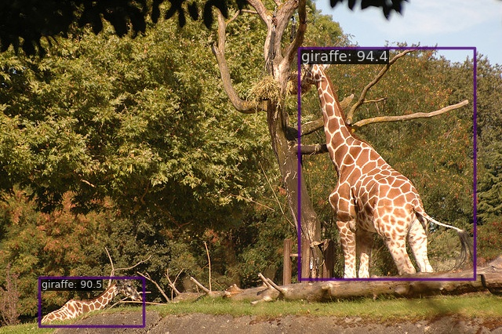

# COCO

[COCO](https://cocodataset.org/#home)

## Run demo

todo: add demo

```
$ docker compose exec dethub python tools/image_demo.py configs/projects/coco/demo/000000000025.jpg configs/projects/coco/rpn/atss_rpn_r50_fpn_1x_coco.py XXX --out-file configs/projects/coco/demo/000000000025_demo.jpg
```



## Prepare datasets

1. Download data from from [official page](https://cocodataset.org/#home)

```
wget http://images.cocodataset.org/zips/train2017.zip
wget http://images.cocodataset.org/zips/val2017.zip
wget http://images.cocodataset.org/annotations/annotations_trainval2017.zip
```

2. Unzip the files as follows

```
data/coco
├── annotations
├── train2017
└── val2017
```

## Run train

Set env variables

```
$ export DATA_DIR=/path/to/data
```

Start a docker container

```
$ docker compose up -d dethub
```

Run train

```
# single gpu
$ docker compose exec dethub mim train mmdet configs/projects/coco/rpn/atss_rpn_r50_fpn.py
# multi gpus
$ docker compose exec dethub mim train mmdet configs/projects/coco/rpn/atss_rpn_r50_fpn.py --gpus 2 --launcher pytorch
```
