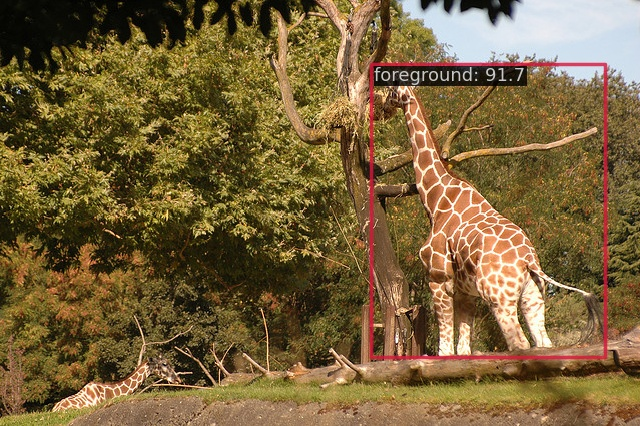

# COCO 1class

[COCO](https://cocodataset.org/#home)

## Run demo

```
$ docker compose exec dethub python tools/image_demo.py configs/projects/coco/demo/000000000025.jpg configs/projects/coco1class/yolox/yolox_s_coco1class.py https://github.com/okotaku/dethub-weights/releases/download/v0.1.1coco1class/yolox_s_coco1class-596787a8.pth --out-file configs/projects/coco1class/demo/000000000025_demo.jpg
```



## Prepare datasets

1. Prepare dataset based on [projects/coco](../coco/README.md)

2. Preprocess 1 class annotation.

```
$ docker compose exec dethub python  tools/dataset_converters/prepare_1class.py data/coco/annotations/instances_train2017.json data/coco/annotations/instances_train2017_1class.json
$ docker compose exec dethub python tools/dataset_converters/prepare_1class.py data/coco/annotations/instances_val2017.json data/coco/annotations/instances_val2017_1class.json
```

## Run train

Set env variables

```
$ export DATA_DIR=/path/to/data
```

Start a docker container

```
$ docker compose up -d dethub
```

Run train

```
# single gpu
$ docker compose exec dethub mim train mmdet configs/projects/coco1class/yolox/yolox_s_coco1class.py
# multi gpus
$ docker compose exec dethub mim train mmdet configs/projects/coco1class/yolox/yolox_s_coco1class.py --gpus 2 --launcher pytorch
```
