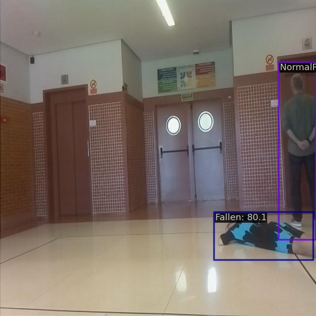

# FindFallenPeople Computer Vision Project

> [FindFallenPeople Computer Vision Project](https://universe.roboflow.com/dongguk-university-raabk/findfallenpeople) from roboflow

## Run demo

```
$ docker compose exec dethub python tools/image_demo.py configs/projects/findfallenpeople/demo/split1_750_png.rf.277c3e8e2f49cdd0505d1b657633c707.jpg configs/projects/findfallenpeople/yolox/yolox_s_findfallenpeople.py https://github.com/okotaku/dethub-weights/releases/download/v0.1.1findfallenpeople/yolox_s_findfallenpeople-2f7d2b6d.pth --out-file configs/projects/findfallenpeople/demo/split1_750_png.rf.277c3e8e2f49cdd0505d1b657633c707_demo.jpg
```



## Prepare datasets

1. Download data from [roboflow](https://universe.roboflow.com/dongguk-university-raabk/findfallenpeople/dataset/3)

2. Unzip the files as follows

```
data/findfallenpeople
├── train
├── valid
└── test
```

## Run train

Set env variables

```
$ export DATA_DIR=/path/to/data
```

Start a docker container

```
$ docker compose up -d dethub
```

Run train

```
# preprocess
$ docker compose exec dethub python tools/dataset_converters/prepare_roboflow.py findfallenpeople

# single gpu
$ docker compose exec dethub mim train mmdet configs/projects/findfallenpeople/yolox/yolox_s_findfallenpeople.py
# multi gpus
$ docker compose exec dethub mim train mmdet configs/projects/findfallenpeople/yolox/yolox_s_findfallenpeople.py --gpus 2 --launcher pytorch
```

## Citation

```latex
@misc{ findfallenpeople_dataset,
    title = { FindFallenPeople Dataset },
    type = { Open Source Dataset },
    author = { dongguk university },
    howpublished = { \url{ https://universe.roboflow.com/dongguk-university-raabk/findfallenpeople } },
    url = { https://universe.roboflow.com/dongguk-university-raabk/findfallenpeople },
    journal = { Roboflow Universe },
    publisher = { Roboflow },
    year = { 2022 },
    month = { nov },
    note = { visited on 2022-12-12 },
}
```
