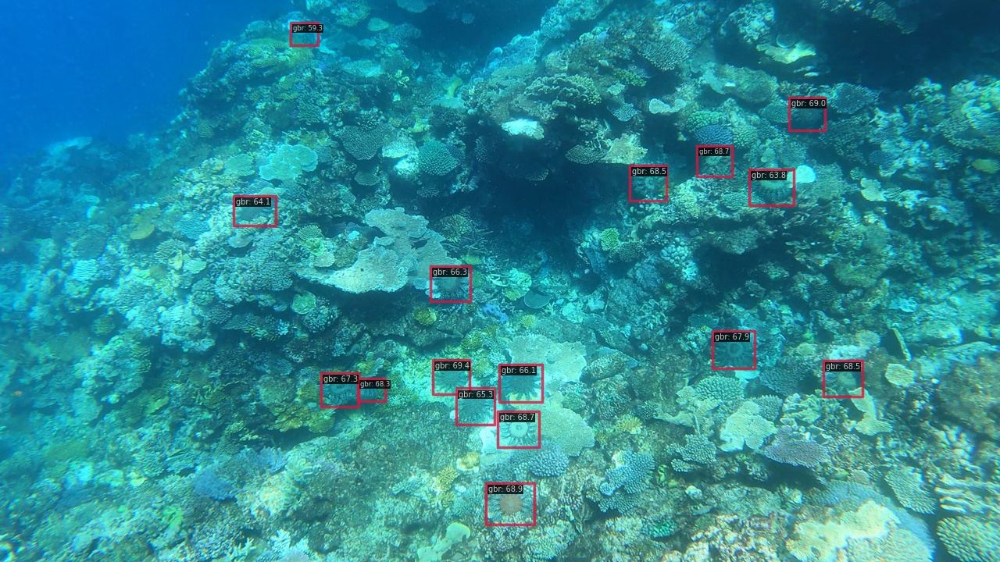

# TensorFlow - Help Protect the Great Barrier Reef (Kaggle)

Kaggle [TensorFlow - Help Protect the Great Barrier Reef](https://www.kaggle.com/competitions/tensorflow-great-barrier-reef)

## Run demo

```
$ docker compose exec dethub python tools/image_demo.py configs/projects/gbr_cots/demo/5756.jpg configs/projects/gbr_cots/yolox/yolox_s_gbr_cots.py https://github.com/okotaku/dethub-weights/releases/download/v0.0.1/yolox_s_gbr_cots-cefaa435.pth --out-file configs/projects/gbr_cots/demo/5756_demo.jpg
```



## Prepare datasets

1. Download competition data from Kaggle

```
kaggle competitions download -c tensorflow-great-barrier-reef
```

2. Download coco format json.

```
kaggle datasets download https://www.kaggle.com/datasets/takuok/gbrcotscocoformat
```

\*We prepared coco format files from [this script](../../../tools/dataset_converters/prepare_gbr_cots.py).

3. Unzip the files as follows

```
data/gbr_cots
├── train_images
├── train.csv
├── dtrain_g0.json
└── dval_g0.json
```

## Run train

Set env variables

```
$ export DATA_DIR=/path/to/data
```

Start a docker container

```
$ docker compose up -d dethub
```

Run train

```
# single gpu
$ docker compose exec dethub python /opt/site-packages/mmdet/.mim/tools/train.py configs/projects/gbr_cots/yolox/yolox_s_gbr_cots.py
# multi gpus
$ docker compose exec dethub python -m torch.distributed.launch --nproc_per_node=2 /opt/site-packages/mmdet/.mim/tools/train.py configs/projects/gbr_cots/yolox/yolox_s_gbr_cots.py --launcher pytorch
```
