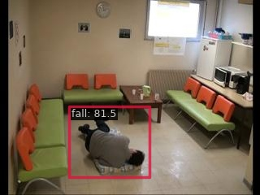

# Le2i Computer Vision Project

> [Le2i Computer Vision Project](https://universe.roboflow.com/new-workspace-qfcus/le2i) from roboflow

<!-- [DATASET] -->

<div align=center>

</div>

## Run demo

```
$ docker compose exec dethub python tools/image_demo.py configs/projects/le2i/demo/001203_jpg.rf.f96d1c443c896ba5a923134797eb3260.jpg configs/projects/le2i/yolox/yolox_s_le2i.py https://github.com/okotaku/dethub-weights/releases/download/v0.1.1crowdhuman/yolox_s_crowdhuman-fd5a218a.pth --out-file configs/projects/le2i/demo/001203_jpg.rf.f96d1c443c896ba5a923134797eb3260_demo.jpg
```



## Prepare datasets

1. Download data from from [roboflow](https://universe.roboflow.com/new-workspace-qfcus/le2i)

2. Unzip the files as follows

```
data/le2i
├── train
├── valid
└── test
```

## Run train

Set env variables

```
$ export DATA_DIR=/path/to/data
```

Start a docker container

```
$ docker compose up -d dethub
```

Run train

```
# preprocess
$ docker compose exec dethub python tools/dataset_converters/prepare_le2i.py

# single gpu
$ docker compose exec dethub mim train mmdet configs/projects/le2i/yolox/yolox_s_le2i.py
# multi gpus
$ docker compose exec dethub mim train mmdet configs/projects/le2i/yolox/yolox_s_le2i.py --gpus 2 --launcher pytorch
```

## Citation

```latex
@misc{ le2i_dataset,
    title = { Le2i Dataset },
    type = { Open Source Dataset },
    author = { New Workspace },
    howpublished = { \url{ https://universe.roboflow.com/new-workspace-qfcus/le2i } },
    url = { https://universe.roboflow.com/new-workspace-qfcus/le2i },
    journal = { Roboflow Universe },
    publisher = { Roboflow },
    year = { 2022 },
    month = { may },
    note = { visited on 2022-12-12 },
}
```
