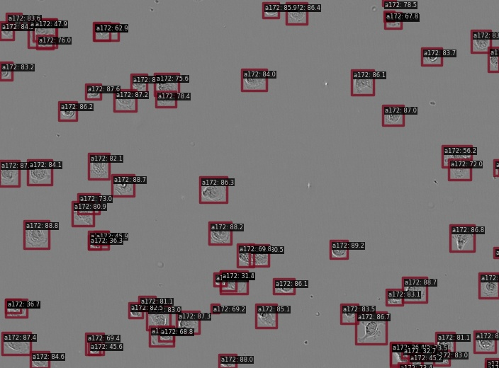

# LIVECell dataset

[LIVECell dataset](https://sartorius-research.github.io/LIVECell/)

## Abstract

Light microscopy combined with well-established protocols of two-dimensional cell culture facilitates high-throughput quantitative imaging to study biological phenomena. Accurate segmentation of individual cells in images enables exploration of
complex biological questions, but can require sophisticated imaging processing pipelines in cases of low contrast and high
object density. Deep learning-based methods are considered state-of-the-art for image segmentation but typically require vast
amounts of annotated data, for which there is no suitable resource available in the field of label-free cellular imaging. Here, we
present LIVECell, a large, high-quality, manually annotated and expert-validated dataset of phase-contrast images, consisting
of over 1.6 million cells from a diverse set of cell morphologies and culture densities. To further demonstrate its use, we train
convolutional neural network-based models using LIVECell and evaluate model segmentation accuracy with a proposed a suite
of benchmarks.

## Run demo

```
$ docker compose exec dethub python tools/image_demo.py configs/projects/livecell/demo/A172_Phase_A7_1_00d00h00m_1.tif configs/projects/livecell/yolox/yolox_s_livecell.py https://github.com/okotaku/dethub-weights/releases/download/v0.0.1/yolox_s_livecell-b3f4347f.pth --out-file configs/projects/livecell/demo/A172_Phase_A7_1_00d00h00m_1_demo.jpg
```



## Prepare datasets

1. Download LIVECell dataset from https://github.com/sartorius-research/LIVECell

```
wget http://livecell-dataset.s3.eu-central-1.amazonaws.com/LIVECell_dataset_2021/images.zip
```

2. Download coco format json [kaggle datasets](https://www.kaggle.com/datasets/takuok/livecellcocoformat).

```
kaggle datasets download takuok/livecellcocoformat
```

\*We prepared coco format files from [this script](../../../tools/dataset_converters/prepare_livecell.py).
Original annotation files from dataset from https://github.com/sartorius-research/LIVECell

```
wget http://livecell-dataset.s3.eu-central-1.amazonaws.com/LIVECell_dataset_2021/annotations/LIVECell/livecell_coco_train.json
wget http://livecell-dataset.s3.eu-central-1.amazonaws.com/LIVECell_dataset_2021/annotations/LIVECell/livecell_coco_val.json
wget http://livecell-dataset.s3.eu-central-1.amazonaws.com/LIVECell_dataset_2021/annotations/LIVECell/livecell_coco_test.json
```

3. Unzip the files as follows

```
data/livecell
├── images
├── livecell_coco_train_8class.json
├── livecell_coco_val_8class.json
└── livecell_coco_test_8class.json
```

## Run train

Set env variables

```
$ export DATA_DIR=/path/to/data
```

Start a docker container

```
$ docker compose up -d dethub
```

Run train

```
# single gpu
$ docker compose exec dethub python /opt/site-packages/mmdet/.mim/tools/train.py configs/projects/livecell/yolox/yolox_s_livecell.py
# multi gpus
$ docker compose exec dethub python -m torch.distributed.launch --nproc_per_node=2 /opt/site-packages/mmdet/.mim/tools/train.py configs/projects/livecell/yolox/yolox_s_livecell.py --launcher pytorch
```

## Acknowledgement

[Kaggle Sartorius - Cell Instance Segmentation 1st place solution](https://github.com/tascj/kaggle-sartorius-cell-instance-segmentation-solution)
