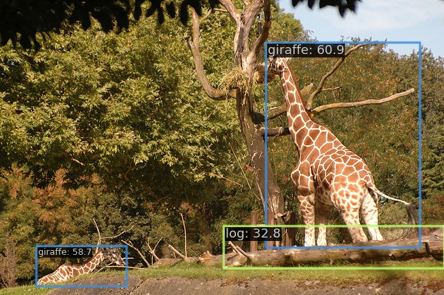

# LVIS

> [LVIS: A Dataset for Large Vocabulary Instance Segmentation](https://arxiv.org/abs/1908.03195)

<!-- [DATASET] -->

## Abstract

Progress on object detection is enabled by datasets that focus the research community's attention on open challenges. This process led us from simple images to complex scenes and from bounding boxes to segmentation masks. In this work, we introduce LVIS (pronounced \`el-vis'): a new dataset for Large Vocabulary Instance Segmentation. We plan to collect ~2 million high-quality instance segmentation masks for over 1000 entry-level object categories in 164k images. Due to the Zipfian distribution of categories in natural images, LVIS naturally has a long tail of categories with few training samples. Given that state-of-the-art deep learning methods for object detection perform poorly in the low-sample regime, we believe that our dataset poses an important and exciting new scientific challenge.

<div align=center>

</div>

## Run demo

```
$ docker compose exec dethub python tools/image_demo.py configs/projects/lvis/demo/000000000025.jpg configs/projects/lvis/dino/dino-4scale_r50_lvis.py --weights https://github.com/okotaku/dethub-weights/releases/download/v0.1.1dino/dino-4scale_r50_lvis-ea80fe74.pth --out-dir configs/projects/lvis/demo/result --palette random
```



## Prepare datasets

1. Download data from from [official page](https://www.lvisdataset.org/)

```
wget http://images.cocodataset.org/zips/train2017.zip
wget http://images.cocodataset.org/zips/val2017.zip
wget https://s3-us-west-2.amazonaws.com/dl.fbaipublicfiles.com/LVIS/lvis_v1_train.json.zip
wget https://s3-us-west-2.amazonaws.com/dl.fbaipublicfiles.com/LVIS/lvis_v1_val.json.zip
```

2. Unzip the files as follows

```
data/lvis_v1
├── annotations
├── train2017
└── val2017
```

## Run train

Set env variables

```
$ export DATA_DIR=/path/to/data
```

Start a docker container

```
$ docker compose up -d dethub
```

Run train

```
# single gpu
$ docker compose exec dethub mim train mmdet configs/projects/lvis/yolox/yolox_s_lvis.py
# multi gpus
$ docker compose exec dethub mim train mmdet configs/projects/lvis/yolox/yolox_s_lvis.py --gpus 2 --launcher pytorch
```

## Citation

```latex
@inproceedings{gupta2019lvis,
  title={{LVIS}: A Dataset for Large Vocabulary Instance Segmentation},
  author={Gupta, Agrim and Dollar, Piotr and Girshick, Ross},
  booktitle={Proceedings of the {IEEE} Conference on Computer Vision and Pattern Recognition},
  year={2019}
}
```
