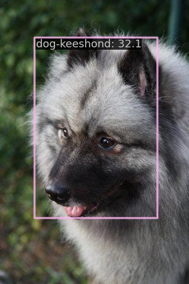

# Oxford Pets Computer Vision Project

> [Oxford Pets Computer Vision Project](https://universe.roboflow.com/brad-dwyer/oxford-pets) from roboflow

<!-- [DATASET] -->

<div align=center>

</div>

## Run demo

```
$ docker compose exec dethub python tools/image_demo.py configs/projects/oxford_pets/demo/keeshond_10_jpg.rf.b831768f3f5245fe5bdee6dff2756d53.jpg configs/projects/oxford_pets/yolox/yolox_s_oxford_pets.py --weights https://github.com/okotaku/dethub-weights/releases/download/v0.1.1oxfordpets/yolox_s_oxford_pets-cebf28f4.pth --out-dir configs/projects/oxford_pets/demo/result
```



## Prepare datasets

1. Download data from [roboflow](https://universe.roboflow.com/brad-dwyer/oxford-pets). This repo used `by-breed` annotation.

2. Unzip the files as follows

```
data/oxford-pets
├── train
├── valid
└── test
```

## Run train

Set env variables

```
$ export DATA_DIR=/path/to/data
```

Start a docker container

```
$ docker compose up -d dethub
```

Run train

```
# preprocess
$ docker compose exec dethub python tools/dataset_converters/prepare_roboflow.py oxford-pets

# single gpu
$ docker compose exec dethub mim train mmdet configs/projects/oxford_pets/yolox/yolox_s_oxford_pets.py
# multi gpus
$ docker compose exec dethub mim train mmdet configs/projects/oxford_pets/yolox/yolox_s_oxford_pets.py --gpus 2 --launcher pytorch
```
