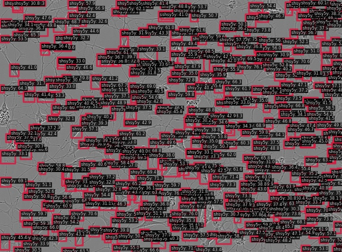

# Sartorius - Cell Instance Segmentation (Kaggle)

Kaggle [Sartorius - Cell Instance Segmentation](https://www.kaggle.com/c/sartorius-cell-instance-segmentation)

## Run demo

```
$ docker compose exec dethub python tools/image_demo.py configs/projects/sartorius_cellseg/demo/0030fd0e6378.png configs/projects/sartorius_cellseg/yolox/yolox_s_sartorius_cellseg.py --weights https://github.com/okotaku/dethub-weights/releases/download/v0.0.1/yolox_s_sartorius_cellseg-3d3d487f.pth --out-dir configs/projects/sartorius_cellseg/demo/result
```



## Prepare datasets

1. Download competition data from Kaggle

```
kaggle competitions download -c sartorius-cell-instance-segmentation
```

2. Download coco format json [kaggle datasets](https://www.kaggle.com/datasets/takuok/sartorius-cocoformat).

```
kaggle datasets download takuok/sartorius-cocoformat
```

\*We prepared coco format files from [this script](../../../tools/dataset_converters/prepare_sartorius_cellseg.py).

3. Unzip the files as follows

```
data/sartorius_cellseg
├── train
├── train_semi_supervised
├── train.csv
├── dtrain.json
└── dval.json
```

## Run train

Set env variables

```
$ export DATA_DIR=/path/to/data
```

Start a docker container

```
$ docker compose up -d dethub
```

Run train

```
# single gpu
$ docker compose exec dethub mim train mmdet configs/projects/sartorius_cellseg/yolox/yolox_s_sartorius_cellseg.py
# multi gpus
$ docker compose exec dethub mim train mmdet configs/projects/sartorius_cellseg/yolox/yolox_s_sartorius_cellseg.py --gpus 2 --launcher pytorch
```

## Acknowledgement

[Kaggle Sartorius - Cell Instance Segmentation 1st place solution](https://github.com/tascj/kaggle-sartorius-cell-instance-segmentation-solution)
