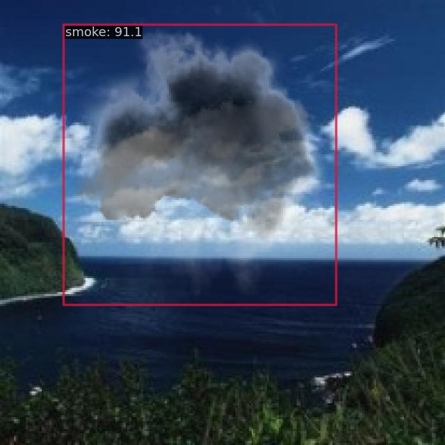

# Smoke100 Computer Vision Project

> [Smoke100 Computer Vision Project](https://universe.roboflow.com/smoke-detection/smoke100-uwe4t) from roboflow

## Run demo

```
$ docker compose exec dethub python tools/image_demo.py configs/projects/smoke100/demo/M_03811_png.rf.dffeb0ed03627dbbc06f9a3ce8da5de7.jpg configs/projects/smoke100/yolox/yolox_s_smoke100.py --weights https://github.com/okotaku/dethub-weights/releases/download/v0.1.1smoke100/yolox_s_smoke100-670611b4.pth --out-dir configs/projects/smoke100/demo/result
```



## Prepare datasets

1. Download data from [roboflow](https://universe.roboflow.com/smoke-detection/smoke100-uwe4t/dataset/4)

2. Unzip the files as follows

```
data/findfallenpeople
├── train
├── valid
└── test
```

## Run train

Set env variables

```
$ export DATA_DIR=/path/to/data
```

Start a docker container

```
$ docker compose up -d dethub
```

Run train

```
# preprocess
$ docker compose exec dethub python tools/dataset_converters/prepare_roboflow.py smoke100

# single gpu
$ docker compose exec dethub mim train mmdet configs/projects/smoke100/yolox/yolox_s_smoke100.py
# multi gpus
$ docker compose exec dethub mim train mmdet configs/projects/smoke100/yolox/yolox_s_smoke100.py --gpus 2 --launcher pytorch
```

## Citation

```latex
@misc{ smoke100-uwe4t_dataset,
    title = { Smoke100 Dataset },
    type = { Open Source Dataset },
    author = { Smoke Detection },
    howpublished = { \url{ https://universe.roboflow.com/smoke-detection/smoke100-uwe4t } },
    url = { https://universe.roboflow.com/smoke-detection/smoke100-uwe4t },
    journal = { Roboflow Universe },
    publisher = { Roboflow },
    year = { 2022 },
    month = { jun },
    note = { visited on 2022-12-13 },
}
```
