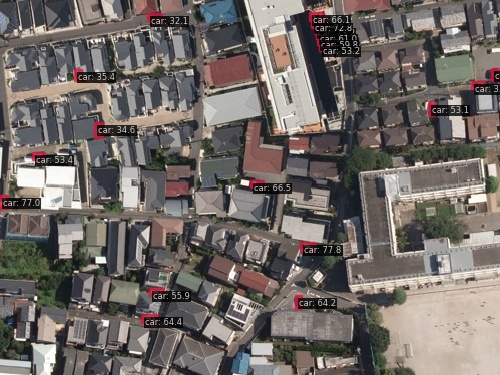

# Vehicle Detection in Multi-Resolution Images (Solafune)

Solafune [Vehicle Detection in Multi-Resolution Images](https://solafune.com/competitions/25012781-b1e8-499e-9c8c-1f9b284d483e)

## Run demo

```
$ docker compose exec dethub python tools/image_demo.py configs/projects/solafune_cardet/demo/train_155.jpg configs/projects/solafune_cardet/yolox/yolox_x_solafune_cardet.py --weights https://github.com/okotaku/dethub-weights/releases/download/v0.1.1solafune-cardet/yolox_x_solafune_cardet-97ba0444.pth --out-dir configs/projects/solafune_cardet/demo/result
```



## Competition Policy

```
# Policy
However, sharing the data provided by Solafune Inc., including secondary works created from them, is prohibited.

# About our contents
It is prohibited to release any data (including secondary products) provided by Solafune Inc.
```

See detail to [competition page](https://solafune.com/competitions/25012781-b1e8-499e-9c8c-1f9b284d483e?menu=about&tab=rule).

In dethub, we check with the Solafune and publish the contents that there are no problems.

## Prepare datasets

Because of competition policy, we provide inference demo only.

## Run train

Because of competition policy, we provide inference demo only.

## Acknowledgement

[motokimura's solution for Solafune "Vehicle Detection in Multi-Resolution Images" competition](https://github.com/motokimura/solafune_vehicle_detection_solution)
